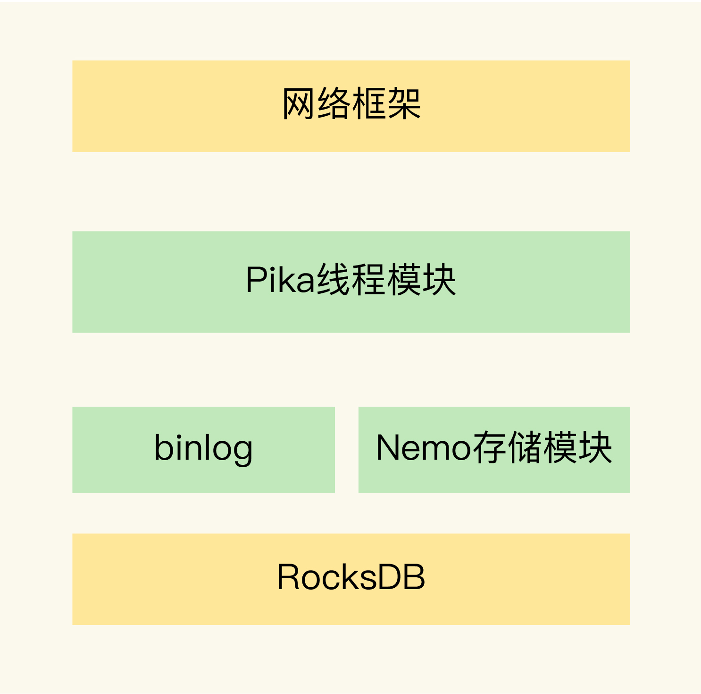
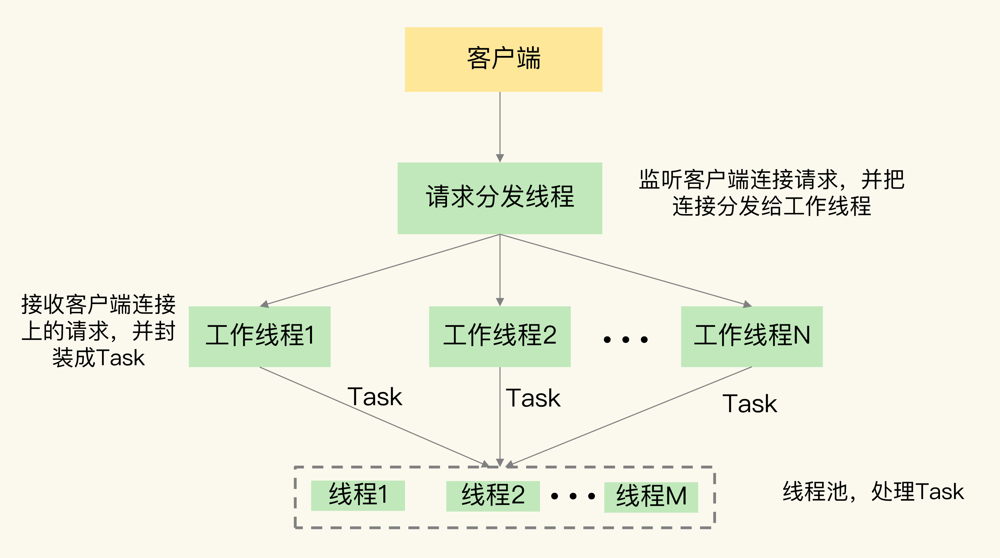
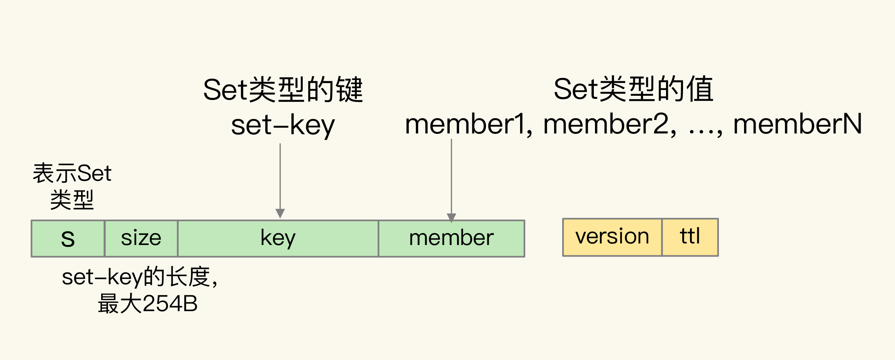
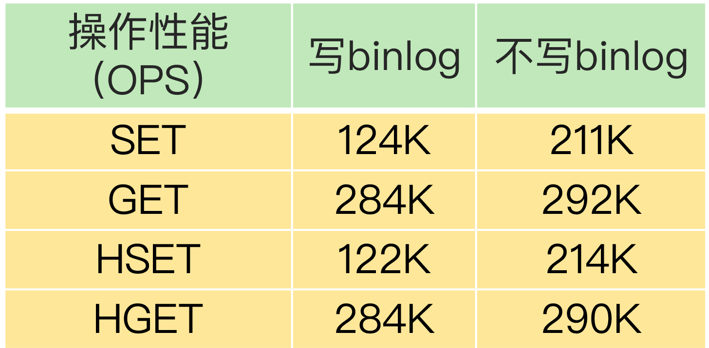

# 28 | Pika：如何基于SSD实现大容量Redis？
<audio src='./28-Pika：如何基于SSD实现大容量Redis？.mp3' controls></audio>
你好，我是蒋德钧。

我们在应用Redis时，随着业务数据的增加（比如说电商业务中，随着用户规模和商品数量的增加），就需要Redis能保存更多的数据。你可能会想到使用Redis切片集群，把数据分散保存到多个实例上。但是这样做的话，会有一个问题，如果要保存的数据总量很大，但是每个实例保存的数据量较小的话，就会导致集群的实例规模增加，这会让集群的运维管理变得复杂，增加开销。

你可能又会说，我们可以通过增加Redis单实例的内存容量，形成大内存实例，每个实例可以保存更多的数据，这样一来，在保存相同的数据总量时，所需要的大内存实例的个数就会减少，就可以节省开销。

这是一个好主意，但这也并不是完美的方案：基于大内存的大容量实例在实例恢复、主从同步过程中会引起一系列潜在问题，例如恢复时间增长、主从切换开销大、缓冲区易溢出。

那怎么办呢？我推荐你使用固态硬盘（Solid State Drive，SSD）。它的成本很低（每GB的成本约是内存的十分之一），而且容量大，读写速度快，我们可以基于SSD来实现大容量的Redis实例。360公司DBA和基础架构组联合开发的Pika [键值数据库](https://github.com/Qihoo360/pika)，正好实现了这一需求。

Pika在刚开始设计的时候，就有两个目标：一是，单实例可以保存大容量数据，同时避免了实例恢复和主从同步时的潜在问题；二是，和Redis数据类型保持兼容，可以支持使用Redis的应用平滑地迁移到Pika上。所以，如果你一直在使用Redis，并且想使用SSD来扩展单实例容量，Pika就是一个很好的选择。

这节课，我就和你聊聊Pika。在介绍Pika前，我先给你具体解释下基于大内存实现大容量Redis实例的潜在问题。只有知道了这些问题，我们才能选择更合适的方案。另外呢，我还会带你一步步分析下Pika是如何实现刚刚我们所说的两个设计目标，解决这些问题的。

## 大内存Redis实例的潜在问题

Redis使用内存保存数据，内存容量增加后，就会带来两方面的潜在问题，分别是，内存快照RDB生成和恢复效率低，以及主从节点全量同步时长增加、缓冲区易溢出。我来一一解释下，

我们先看内存快照RDB受到的影响。内存大小和内存快照RDB的关系是非常直接的：实例内存容量大，RDB文件也会相应增大，那么，RDB文件生成时的fork时长就会增加，这就会导致Redis实例阻塞。而且，RDB文件增大后，使用RDB进行恢复的时长也会增加，会导致Redis较长时间无法对外提供服务。

接下来我们再来看下主从同步受到的影响，

主从节点间的同步的第一步就是要做全量同步。全量同步是主节点生成RDB文件，并传给从节点，从节点再进行加载。试想一下，如果RDB文件很大，肯定会导致全量同步的时长增加，效率不高，而且还可能会导致复制缓冲区溢出。一旦缓冲区溢出了，主从节点间就会又开始全量同步，影响业务应用的正常使用。如果我们增加复制缓冲区的容量，这又会消耗宝贵的内存资源。

此外，如果主库发生了故障，进行主从切换后，其他从库都需要和新主库进行一次全量同步。如果RDB文件很大，也会导致主从切换的过程耗时增加，同样会影响业务的可用性。

那么，Pika是如何解决这两方面的问题呢？这就要提到Pika中的关键模块RocksDB、binlog机制和Nemo了，这些模块都是Pika架构中的重要组成部分。所以，接下来，我们就来先看下Pika的整体架构。

## Pika的整体架构

Pika键值数据库的整体架构中包括了五部分，分别是网络框架、Pika线程模块、Nemo存储模块、RocksDB和binlog机制，如下图所示：



这五个部分分别实现了不同的功能，下面我一个个来介绍下。

首先，网络框架主要负责底层网络请求的接收和发送。Pika的网络框架是对操作系统底层的网络函数进行了封装。Pika在进行网络通信时，可以直接调用网络框架封装好的函数。

其次，Pika线程模块采用了多线程模型来具体处理客户端请求，包括一个请求分发线程（DispatchThread）、一组工作线程（WorkerThread）以及一个线程池（ThreadPool）。

请求分发线程专门监听网络端口，一旦接收到客户端的连接请求后，就和客户端建立连接，并把连接交由工作线程处理。工作线程负责接收客户端连接上发送的具体命令请求，并把命令请求封装成Task，再交给线程池中的线程，由这些线程进行实际的数据存取处理，如下图所示：



在实际应用Pika的时候，我们可以通过增加工作线程数和线程池中的线程数，来提升Pika的请求处理吞吐率，进而满足业务层对数据处理性能的需求。

Nemo模块很容易理解，它实现了Pika和Redis的数据类型兼容。这样一来，当我们把Redis服务迁移到Pika时，不用修改业务应用中操作Redis的代码，而且还可以继续应用运维Redis的经验，这使得Pika的学习成本就较低。Nemo模块对数据类型的具体转换机制是我们要重点关心的，下面我会具体介绍。

最后，我们再来看看RocksDB提供的基于SSD保存数据的功能。它使得Pika可以不用大容量的内存，就能保存更多数据，还避免了使用内存快照。而且，Pika使用binlog机制记录写命令，用于主从节点的命令同步，避免了刚刚所说的大内存实例在主从同步过程中的潜在问题。

接下来，我们就来具体了解下，Pika是如何使用RocksDB和binlog机制的。

## Pika如何基于SSD保存更多数据？

为了把数据保存到SSD，Pika使用了业界广泛应用的持久化键值数据库 [RocksDB](https://rocksdb.org/)。RocksDB本身的实现机制较为复杂，你不需要全部弄明白，你只要记住RocksDB的基本数据读写机制，对于学习了解Pika来说，就已经足够了。下面我来解释下这个基本读写机制。

下面我结合一张图片，来给你具体介绍下RocksDB写入数据的基本流程。


当Pika需要保存数据时，RocksDB会使用两小块内存空间（Memtable1和Memtable2）来交替缓存写入的数据。Memtable的大小可以设置，一个Memtable的大小一般为几MB或几十MB。当有数据要写入RocksDB时，RocksDB会先把数据写入到Memtable1。等到Memtable1写满后，RocksDB再把数据以文件的形式，快速写入底层的SSD。同时，RocksDB会使用Memtable2来代替Memtable1，缓存新写入的数据。等到Memtable1的数据都写入SSD了，RocksDB会在Memtable2写满后，再用Memtable1缓存新写入的数据。

这么一分析你就知道了，RocksDB会先用Memtable缓存数据，再将数据快速写入SSD，即使数据量再大，所有数据也都能保存到SSD中。而且，Memtable本身容量不大，即使RocksDB使用了两个Memtable，也不会占用过多的内存，这样一来，Pika在保存大容量数据时，也不用占据太大的内存空间了。

当Pika需要读取数据的时候，RocksDB会先在Memtable中查询是否有要读取的数据。这是因为，最新的数据都是先写入到Memtable中的。如果Memtable中没有要读取的数据，RocksDB会再查询保存在SSD上的数据文件，如下图所示：


到这里，你就了解了，当使用了RocksDB保存数据后，Pika就可以把大量数据保存到大容量的SSD上了，实现了大容量实例。不过，我刚才向你介绍过，当使用大内存实例保存大量数据时，Redis会面临RDB生成和恢复的效率问题，以及主从同步时的效率和缓冲区溢出问题。那么，当Pika保存大量数据时，还会面临相同的问题吗？

其实不会了，我们来分析一下。

一方面，Pika基于RocksDB保存了数据文件，直接读取数据文件就能恢复，不需要再通过内存快照进行恢复了。而且，Pika从库在进行全量同步时，可以直接从主库拷贝数据文件，不需要使用内存快照，这样一来，Pika就避免了大内存快照生成效率低的问题。

另一方面，Pika使用了binlog机制实现增量命令同步，既节省了内存，还避免了缓冲区溢出的问题。binlog是保存在SSD上的文件，Pika接收到写命令后，在把数据写入Memtable时，也会把命令操作写到binlog文件中。和Redis类似，当全量同步结束后，从库会从binlog中把尚未同步的命令读取过来，这样就可以和主库的数据保持一致。当进行增量同步时，从库也是把自己已经复制的偏移量发给主库，主库把尚未同步的命令发给从库，来保持主从库的数据一致。

不过，和Redis使用缓冲区相比，使用binlog好处是非常明显的：binlog是保存在SSD上的文件，文件大小不像缓冲区，会受到内存容量的较多限制。而且，当binlog文件增大后，还可以通过轮替操作，生成新的binlog文件，再把旧的binlog文件独立保存。这样一来，即使Pika实例保存了大量的数据，在同步过程中也不会出现缓冲区溢出的问题了。

现在，我们先简单小结下。Pika使用RocksDB把大量数据保存到了SSD，同时避免了内存快照的生成和恢复问题。而且，Pika使用binlog机制进行主从同步，避免大内存时的影响，Pika的第一个设计目标就实现了。

接下来，我们再来看Pika是如何实现第二个设计目标的，也就是如何和Redis兼容。毕竟，如果不兼容的话，原来使用Redis的业务就无法平滑迁移到Pika上使用了，也就没办法利用Pika保存大容量数据的优势了。

## Pika如何实现Redis数据类型兼容？

Pika的底层存储使用了RocksDB来保存数据，但是，RocksDB只提供了单值的键值对类型，RocksDB键值对中的值就是单个值，而Redis键值对中的值还可以是集合类型。

对于Redis的String类型来说，它本身就是单值的键值对，我们直接用RocksDB保存就行。但是，对于集合类型来说，我们就无法直接把集合保存为单值的键值对，而是需要进行转换操作。

为了保持和Redis的兼容性，Pika的Nemo模块就负责把Redis的集合类型转换成单值的键值对。简单来说，我们可以把Redis的集合类型分成两类：

- 一类是List和Set类型，它们的集合中也只有单值；
- 另一类是Hash和Sorted Set类型，它们的集合中的元素是成对的，其中，Hash集合元素是field-value类型，而Sorted Set集合元素是member-score类型。

Nemo模块通过转换操作，把这4种集合类型的元素表示为单值的键值对。具体怎么转换呢？下面我们来分别看下每种类型的转换。

首先我们来看List类型。在Pika中，List集合的key被嵌入到了单值键值对的键当中，用key字段表示；而List集合的元素值，则被嵌入到单值键值对的值当中，用value字段表示。因为List集合中的元素是有序的，所以，Nemo模块还在单值键值对的key后面增加了sequence字段，表示当前元素在List中的顺序，同时，还在value的前面增加了previous sequence和next sequence这两个字段，分别表示当前元素的前一个元素和后一个元素。

此外，在单值键值对的key前面，Nemo模块还增加了一个值“l”，表示当前数据是List类型，以及增加了一个1字节的size字段，表示List集合key的大小。在单值键值对的value后面，Nemo模块还增加了version和ttl字段，分别表示当前数据的版本号和剩余存活时间（用来支持过期key功能），如下图所示：


我们再来看看Set集合。

Set集合的key和元素member值，都被嵌入到了Pika单值键值对的键当中，分别用key和member字段表示。同时，和List集合类似，单值键值对的key前面有值“s”，用来表示数据是Set类型，同时还有size字段，用来表示key的大小。Pika单值键值对的值只保存了数据的版本信息和剩余存活时间，如下图所示：



对于Hash类型来说，Hash集合的key被嵌入到单值键值对的键当中，用key字段表示，而Hash集合元素的field也被嵌入到单值键值对的键当中，紧接着key字段，用field字段表示。Hash集合元素的value则是嵌入到单值键值对的值当中，并且也带有版本信息和剩余存活时间，如下图所示：


最后，对于Sorted Set类型来说，该类型是需要能够按照集合元素的score值排序的，而RocksDB只支持按照单值键值对的键来排序。所以，Nemo模块在转换数据时，就把Sorted Set集合key、元素的score和member值都嵌入到了单值键值对的键当中，此时，单值键值对中的值只保存了数据的版本信息和剩余存活时间，如下图所示：


采用了上面的转换方式之后，Pika不仅能兼容支持Redis的数据类型，而且还保留了这些数据类型的特征，例如List的元素保序、Sorted Set的元素按score排序。了解了Pika的转换机制后，你就会明白，如果你有业务应用计划从使用Redis切换到使用Pika，就不用担心面临因为操作接口不兼容而要修改业务应用的问题了。

经过刚刚的分析，我们可以知道，Pika能够基于SSD保存大容量数据，而且和Redis兼容，这是它的两个优势。接下来，我们再来看看，跟Redis相比，Pika的其他优势，以及潜在的不足。当在实际应用Pika时，Pika的不足之处是你需要特别注意的地方，这些可能都需要你进行系统配置或参数上的调优。

## Pika的其他优势与不足

跟Redis相比，Pika最大的特点就是使用了SSD来保存数据，这个特点能带来的最直接好处就是，Pika单实例能保存更多的数据了，实现了实例数据扩容。

除此之外，Pika使用SSD来保存数据，还有额外的两个优势。

首先， **实例重启快**。Pika的数据在写入数据库时，是会保存到SSD上的。当Pika实例重启时，可以直接从SSD上的数据文件中读取数据，不需要像Redis一样，从RDB文件全部重新加载数据或是从AOF文件中全部回放操作，这极大地提高了Pika实例的重启速度，可以快速处理业务应用请求。

另外，主从库重新执行全量同步的风险低。Pika通过binlog机制实现写命令的增量同步，不再受内存缓冲区大小的限制，所以，即使在数据量很大导致主从库同步耗时很长的情况下，Pika也不用担心缓冲区溢出而触发的主从库重新全量同步。

但是，就像我在前面的课程中和你说的，“硬币都是有正反两面的”，Pika也有自身的一些不足。

虽然它保持了Redis操作接口，也能实现数据库扩容，但是，当把数据保存到SSD上后，会降低数据的访问性能。这是因为，数据操作毕竟不能在内存中直接执行了，而是要在底层的SSD中进行存取，这肯定会影响，Pika的性能。而且，我们还需要把binlog机制记录的写命令同步到SSD上，这会降低Pika的写性能。

不过，Pika的多线程模型，可以同时使用多个线程进行数据读写，这在一定程度上弥补了从SSD存取数据造成的性能损失。当然，你也可以使用高配的SSD来提升访问性能，进而减少读写SSD对Pika性能的影响。

为了帮助你更直观地了解Pika的性能情况，我再给你提供一张表，这是Pika [官网](https://github.com/Qihoo360/pika/wiki/3.2.x-Performance) 上提供的测试数据。



这些数据是在Pika 3.2版本中，String和Hash类型在多线程情况下的基本操作性能结果。从表中可以看到，在不写binlog时，Pika的SET/GET、HSET/HGET的性能都能达到200K OPS以上，而一旦增加了写binlog操作，SET和HSET操作性能大约下降了41%，只有约120K OPS。

所以，我们在使用Pika时，需要在单实例扩容的必要性和可能的性能损失间做个权衡。如果保存大容量数据是我们的首要需求，那么，Pika是一个不错的解决方案。

## 小结

这节课，我们学习了基于SSD给Redis单实例进行扩容的技术方案Pika。跟Redis相比，Pika的好处非常明显：既支持Redis操作接口，又能支持保存大容量的数据。如果你原来就在应用Redis，现在想进行扩容，那么，Pika无疑是一个很好的选择，无论是代码迁移还是运维管理，Pika基本不需要额外的工作量。

不过，Pika毕竟是把数据保存到了SSD上，数据访问要读写SSD，所以，读写性能要弱于Redis。针对这一点，我给你提供两个降低读写SSD对Pika的性能影响的小建议：

1. 利用Pika的多线程模型，增加线程数量，提升Pika的并发请求处理能力；
2. 为Pika配置高配的SSD，提升SSD自身的访问性能。

最后，我想再给你一个小提示。Pika本身提供了很多工具，可以帮助我们把Redis数据迁移到Pika，或者是把Redis请求转发给Pika。比如说，我们使用aof\_to\_pika命令，并且指定Redis的AOF文件以及Pika的连接信息，就可以把Redis数据迁移到Pika中了，如下所示：

```
aof_to_pika -i [Redis AOF文件] -h [Pika IP] -p [Pika port] -a [认证信息]

```

关于这些工具的信息，你都可以直接在Pika的 [GitHub](https://github.com/Qihoo360/pika/wiki) 上找到。而且，Pika本身也还在迭代开发中，我也建议你多去看看GitHub，进一步地了解它。这样，你就可以获得Pika的最新进展，也能更好地把它应用到你的业务实践中。

## 每课一问

按照惯例，我给你提个小问题。这节课，我向你介绍的是使用SSD作为内存容量的扩展，增加Redis实例的数据保存量，我想请你来聊一聊，我们可以使用机械硬盘来作为实例容量扩展吗，有什么好处或不足吗？

欢迎在留言区写下你的思考和答案，我们一起交流讨论。如果你觉得今天的内容对你有所帮助，也欢迎你分享给你的朋友或同事。我们下节课见。