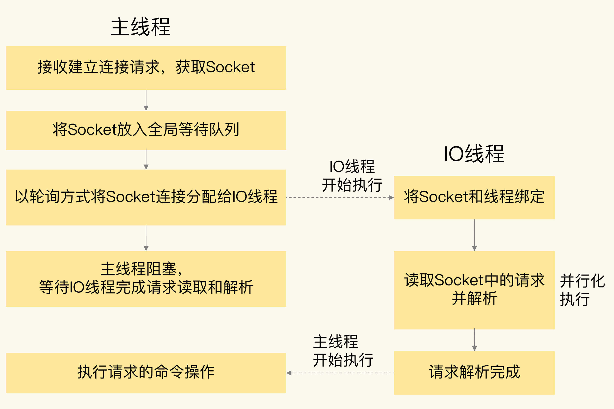
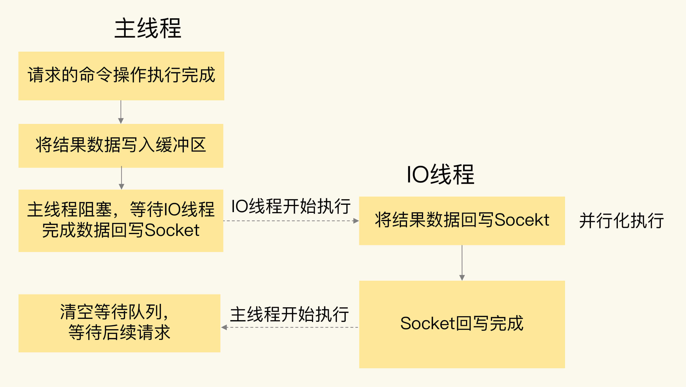

# 39 | Redis 6.0的新特性：多线程、客户端缓存与安全
<audio src='./39-Redis6.0的新特性：多线程、客户端缓存与安全.mp3' controls></audio>
你好，我是蒋德钧。

Redis官方在今年5月份正式推出了6.0版本，这个版本中有很多的新特性。所以，6.0刚刚推出，就受到了业界的广泛关注。

所以，在课程的最后，我特意安排了这节课，想来和你聊聊Redis 6.0中的几个关键新特性，分别是面向网络处理的多IO线程、客户端缓存、细粒度的权限控制，以及RESP 3协议的使用。

其中，面向网络处理的多IO线程可以提高网络请求处理的速度，而客户端缓存可以让应用直接在客户端本地读取数据，这两个特性可以提升Redis的性能。除此之外，细粒度权限控制让Redis可以按照命令粒度控制不同用户的访问权限，加强了Redis的安全保护。RESP 3协议则增强客户端的功能，可以让应用更加方便地使用Redis的不同数据类型。

只有详细掌握了这些特性的原理，你才能更好地判断是否使用6.0版本。如果你已经在使用6.0了，也可以看看怎么才能用得更好，少踩坑。

首先，我们来了解下6.0版本中新出的多线程特性。

## 从单线程处理网络请求到多线程处理

**在Redis 6.0中，非常受关注的第一个新特性就是多线程**。这是因为，Redis一直被大家熟知的就是它的单线程架构，虽然有些命令操作可以用后台线程或子进程执行（比如数据删除、快照生成、AOF重写），但是，从网络IO处理到实际的读写命令处理，都是由单个线程完成的。

随着网络硬件的性能提升，Redis的性能瓶颈有时会出现在网络IO的处理上，也就是说， **单个主线程处理网络请求的速度跟不上底层网络硬件的速度**。

为了应对这个问题，一般有两种方法。

第一种方法是，用用户态网络协议栈（例如DPDK）取代内核网络协议栈，让网络请求的处理不用在内核里执行，直接在用户态完成处理就行。

对于高性能的Redis来说，避免频繁让内核进行网络请求处理，可以很好地提升请求处理效率。但是，这个方法要求在Redis的整体架构中，添加对用户态网络协议栈的支持，需要修改Redis源码中和网络相关的部分（例如修改所有的网络收发请求函数），这会带来很多开发工作量。而且新增代码还可能引入新Bug，导致系统不稳定。所以，Redis 6.0中并没有采用这个方法。

第二种方法就是采用多个IO线程来处理网络请求，提高网络请求处理的并行度。Redis 6.0就是采用的这种方法。

但是，Redis的多IO线程只是用来处理网络请求的，对于读写命令，Redis仍然使用单线程来处理。这是因为，Redis处理请求时，网络处理经常是瓶颈，通过多个IO线程并行处理网络操作，可以提升实例的整体处理性能。而继续使用单线程执行命令操作，就不用为了保证Lua脚本、事务的原子性，额外开发多线程互斥机制了。这样一来，Redis线程模型实现就简单了。

我们来看下，在Redis 6.0中，主线程和IO线程具体是怎么协作完成请求处理的。掌握了具体原理，你才能真正地会用多线程。为了方便你理解，我们可以把主线程和多IO线程的协作分成四个阶段。

**阶段一：服务端和客户端建立Socket连接，并分配处理线程**

首先，主线程负责接收建立连接请求。当有客户端请求和实例建立Socket连接时，主线程会创建和客户端的连接，并把 Socket 放入全局等待队列中。紧接着，主线程通过轮询方法把Socket连接分配给IO线程。

**阶段二：IO线程读取并解析请求**

主线程一旦把Socket分配给IO线程，就会进入阻塞状态，等待IO线程完成客户端请求读取和解析。因为有多个IO线程在并行处理，所以，这个过程很快就可以完成。

**阶段三：主线程执行请求操作**

等到IO线程解析完请求，主线程还是会以单线程的方式执行这些命令操作。下面这张图显示了刚才介绍的这三个阶段，你可以看下，加深理解。



**阶段四：IO线程回写Socket和主线程清空全局队列**

当主线程执行完请求操作后，会把需要返回的结果写入缓冲区，然后，主线程会阻塞等待IO线程把这些结果回写到Socket中，并返回给客户端。

和IO线程读取和解析请求一样，IO线程回写Socket时，也是有多个线程在并发执行，所以回写Socket的速度也很快。等到IO线程回写Socket完毕，主线程会清空全局队列，等待客户端的后续请求。

我也画了一张图，展示了这个阶段主线程和IO线程的操作，你可以看下。



了解了Redis主线程和多线程的协作方式，我们该怎么启用多线程呢？在Redis 6.0中，多线程机制默认是关闭的，如果需要使用多线程功能，需要在redis.conf中完成两个设置。

**1.设置io-thread-do-reads配置项为yes，表示启用多线程。**

```
io-threads-do-reads yes

```

2.设置线程个数。一般来说， **线程个数要小于Redis实例所在机器的CPU核个数**，例如，对于一个8核的机器来说，Redis官方建议配置6个IO线程。

```
io-threads  6

```

如果你在实际应用中，发现Redis实例的CPU开销不大，吞吐量却没有提升，可以考虑使用Redis 6.0的多线程机制，加速网络处理，进而提升实例的吞吐量。

## 实现服务端协助的客户端缓存

和之前的版本相比，Redis 6.0新增了一个重要的特性，就是实现了服务端协助的客户端缓存功能，也称为跟踪（Tracking）功能。有了这个功能，业务应用中的Redis客户端就可以把读取的数据缓存在业务应用本地了，应用就可以直接在本地快速读取数据了。

不过，当把数据缓存在客户端本地时，我们会面临一个问题： **如果数据被修改了或是失效了，如何通知客户端对缓存的数据做失效处理？**

6.0实现的Tracking功能实现了两种模式，来解决这个问题。

**第一种模式是普通模式**。在这个模式下，实例会在服务端记录客户端读取过的key，并监测key是否有修改。一旦key的值发生变化，服务端会给客户端发送invalidate消息，通知客户端缓存失效了。

在使用普通模式时，有一点你需要注意一下，服务端对于记录的key只会报告一次invalidate消息，也就是说，服务端在给客户端发送过一次invalidate消息后，如果key再被修改，此时，服务端就不会再次给客户端发送invalidate消息。

只有当客户端再次执行读命令时，服务端才会再次监测被读取的key，并在key修改时发送invalidate消息。这样设计的考虑是节省有限的内存空间。毕竟，如果客户端不再访问这个key了，而服务端仍然记录key的修改情况，就会浪费内存资源。

我们可以通过执行下面的命令，打开或关闭普通模式下的Tracking功能。

```
CLIENT TRACKING ON|OFF

```

**第二种模式是广播模式**。在这个模式下，服务端会给客户端广播所有key的失效情况，不过，这样做了之后，如果key 被频繁修改，服务端会发送大量的失效广播消息，这就会消耗大量的网络带宽资源。

所以，在实际应用时，我们会让客户端注册希望跟踪的key的前缀，当带有注册前缀的key被修改时，服务端会把失效消息广播给所有注册的客户端。 **和普通模式不同，在广播模式下，即使客户端还没有读取过key，但只要它注册了要跟踪的key，服务端都会把key失效消息通知给这个客户端**。

我给你举个例子，带你看一下客户端如何使用广播模式接收key失效消息。当我们在客户端执行下面的命令后，如果服务端更新了user:id:1003这个key，那么，客户端就会收到invalidate消息。

```
CLIENT TRACKING ON BCAST PREFIX user

```

这种监测带有前缀的key的广播模式，和我们对key的命名规范非常匹配。我们在实际应用时，会给同一业务下的key设置相同的业务名前缀，所以，我们就可以非常方便地使用广播模式。

不过，刚才介绍的普通模式和广播模式，需要客户端使用RESP 3协议，RESP 3协议是6.0新启用的通信协议，一会儿我会给你具体介绍。

对于使用RESP 2协议的客户端来说，就需要使用另一种模式，也就是重定向模式（redirect）。在重定向模式下，想要获得失效消息通知的客户端，就需要执行订阅命令SUBSCRIBE，专门订阅用于发送失效消息的频道\_redis\_:invalidate。同时，再使用另外一个客户端，执行CLIENT TRACKING命令，设置服务端将失效消息转发给使用RESP 2协议的客户端。

我再给你举个例子，带你了解下如何让使用RESP 2协议的客户端也能接受失效消息。假设客户端B想要获取失效消息，但是客户端B只支持RESP 2协议，客户端A支持RESP 3协议。我们可以分别在客户端B和A上执行SUBSCRIBE和CLIENT TRACKING，如下所示：

```
//客户端B执行，客户端B的ID号是303
SUBSCRIBE _redis_:invalidate

//客户端A执行
CLIENT TRACKING ON BCAST REDIRECT 303

```

这样设置以后，如果有键值对被修改了，客户端B就可以通过\_redis\_:invalidate频道，获得失效消息了。

好了，了解了6.0 版本中的客户端缓存特性后，我们再来了解下第三个关键特性，也就是实例的访问权限控制列表功能（Access Control List，ACL），这个特性可以有效地提升Redis的使用安全性。

## 从简单的基于密码访问到细粒度的权限控制

在Redis 6.0 版本之前，要想实现实例的安全访问，只能通过设置密码来控制，例如，客户端连接实例前需要输入密码。

此外，对于一些高风险的命令（例如KEYS、FLUSHDB、FLUSHALL等），在Redis 6.0 之前，我们也只能通过rename-command来重新命名这些命令，避免客户端直接调用。

Redis 6.0 提供了更加细粒度的访问权限控制，这主要有两方面的体现。

**首先，6.0版本支持创建不同用户来使用Redis**。在6.0版本前，所有客户端可以使用同一个密码进行登录使用，但是没有用户的概念，而在6.0中，我们可以使用ACL SETUSER命令创建用户。例如，我们可以执行下面的命令，创建并启用一个用户normaluser，把它的密码设置为“abc”：

```
ACL SETUSER normaluser on > abc

```

**另外，6.0版本还支持以用户为粒度设置命令操作的访问权限**。我把具体操作列在了下表中，你可以看下，其中，加号（+）和减号（-）就分别表示给用户赋予或撤销命令的调用权限。


为了便于你理解，我给你举个例子。假设我们要设置用户normaluser只能调用Hash类型的命令操作，而不能调用String类型的命令操作，我们可以执行如下命令：

```
ACL SETUSER normaluser +@hash -@string

```

除了设置某个命令或某类命令的访问控制权限，6.0版本还支持以key为粒度设置访问权限。

具体的做法是使用波浪号“~”和key的前缀来表示控制访问的key。例如，我们执行下面命令，就可以设置用户normaluser只能对以“user:”为前缀的key进行命令操作：

```
ACL SETUSER normaluser ~user:* +@all

```

好了，到这里，你了解了，Redis 6.0可以设置不同用户来访问实例，而且可以基于用户和key的粒度，设置某个用户对某些key允许或禁止执行的命令操作。

这样一来，我们在有多用户的Redis应用场景下，就可以非常方便和灵活地为不同用户设置不同级别的命令操作权限了，这对于提供安全的Redis访问非常有帮助。

## 启用RESP 3协议

Redis 6.0实现了RESP 3通信协议，而之前都是使用的RESP 2。在RESP 2中，客户端和服务器端的通信内容都是以字节数组形式进行编码的，客户端需要根据操作的命令或是数据类型自行对传输的数据进行解码，增加了客户端开发复杂度。

而RESP 3直接支持多种数据类型的区分编码，包括空值、浮点数、布尔值、有序的字典集合、无序的集合等。

所谓区分编码，就是指直接通过不同的开头字符，区分不同的数据类型，这样一来，客户端就可以直接通过判断传递消息的开头字符，来实现数据转换操作了，提升了客户端的效率。除此之外，RESP 3协议还可以支持客户端以普通模式和广播模式实现客户端缓存。

## 小结

这节课，我向你介绍了Redis 6.0的新特性，我把这些新特性总结在了一张表里，你可以再回顾巩固下。


最后，我也再给你一个小建议：因为Redis 6.0是刚刚推出的，新的功能特性还需要在实际应用中进行部署和验证，所以，如果你想试用Redis 6.0，可以尝试先在非核心业务上使用Redis 6.0，一方面可以验证新特性带来的性能或功能优势，另一方面，也可以避免因为新特性不稳定而导致核心业务受到影响。

## 每课一问

你觉得，Redis 6.0的哪个或哪些新特性会对你有帮助呢？

欢迎在留言区写下你的思考和答案，我们一起交流讨论。如果你觉得今天的内容对你有所帮助，也欢迎你分享给你的朋友或同事。我们下节课见。